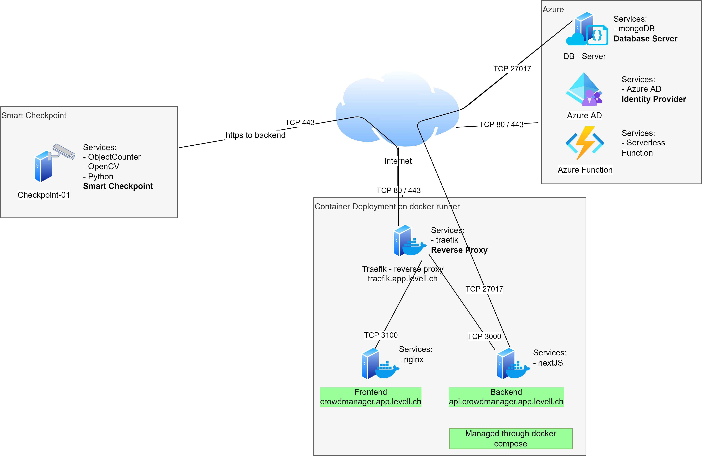

# Crowd Manager - Web Interface

## How it works
Provides the possibility to manage the checkpoint and view the movement of the crowd based on the aggregated information.
Furthermore the backend is used by the checkpoints to upload their measurements.

The application consists of a frontend written in react and a backend written in NextJS. For the storage of the data mongodb is used.

## Design
The website will be structured in an traditional frontend and backend architecture.

For simplifying the development and deployment of the application CI/CD will be used.

### Frontend
Using react in combination the bootstrap to create a intuitive UI.

### Backend
Backend API is using NextJS and mongodb as datastore.

## Database Layout

## Development
### Visual Studio Code
The project is developed using Visual Studio Code. For the development a dev container is used. This container contains all the necessary tools to develop the application. The container is based on the official node image.

### Environment Variables
To control the application behavior the following environment variables are available:

    # Authentication
    KEYCLOAK_ID=
    KEYCLOAK_SECRET=
    KEYCLOAK_ISSUER=

    # NEXT env variables
    NEXT_PUBLIC=PUBLIC
    NEXTAUTH_URL=
    NEXTAUTH_SECRET=        # using https://generate-secret.vercel.app/32

    # MONGO DB
    MONGO_DB_STRING=db

## Local DB
Using the following docker command a local mongo DB instance can be instantiated.

    docker run -e MONGO_INITDB_ROOT_USERNAME=mongoadmin -e MONGO_INITDB_ROOT_PASSWORD=password -p 27017:27017 --name crowdmanager-mongo -d --restart always mongo

### Available Scripts - nextjs
In the project directory, you can run:

#### `npm start`

Runs the app in the development mode.\
Open [http://localhost:3000](http://localhost:3000) to view it in the browser.

The page will reload if you make edits.\
You will also see any lint errors in the console.

#### `npm test`

Launches the test runner in the interactive watch mode.\
See the section about [running tests](https://facebook.github.io/create-react-app/docs/running-tests) for more information.

#### `npm run build`

Builds the app for production to the `build` folder.\
It correctly bundles React in production mode and optimizes the build for the best performance.

The build is minified and the filenames include the hashes.\
Your app is ready to be deployed!

See the section about [deployment](https://facebook.github.io/create-react-app/docs/deployment) for more information.

#### `npm run eject`

**Note: this is a one-way operation. Once you `eject`, you can’t go back!**

If you aren’t satisfied with the build tool and configuration choices, you can `eject` at any time. This command will remove the single build dependency from your project.

Instead, it will copy all the configuration files and the transitive dependencies (webpack, Babel, ESLint, etc) right into your project so you have full control over them. All of the commands except `eject` will still work, but they will point to the copied scripts so you can tweak them. At this point you’re on your own.

You don’t have to ever use `eject`. The curated feature set is suitable for small and middle deployments, and you shouldn’t feel obligated to use this feature. However we understand that this tool wouldn’t be useful if you couldn’t customize it when you are ready for it.

## Production
The application is deployed on a Docker Swarm cluster. The docker-compose file is located in the root directory of the project.

The deployment is done using GitHub Actions.

The database will be hosted on a MongoDB cluster within the cloud.
