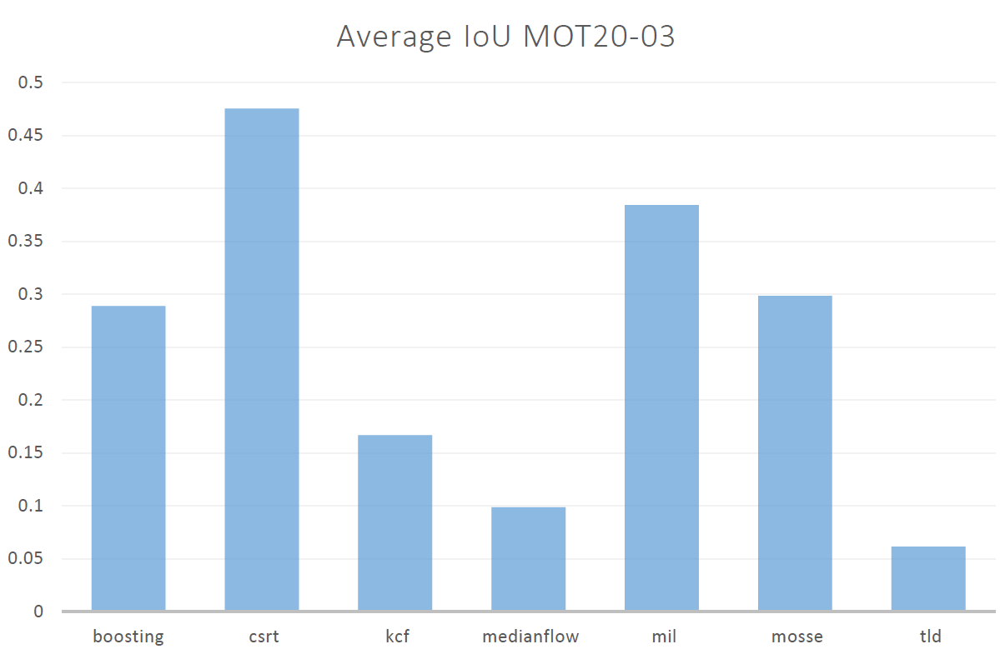
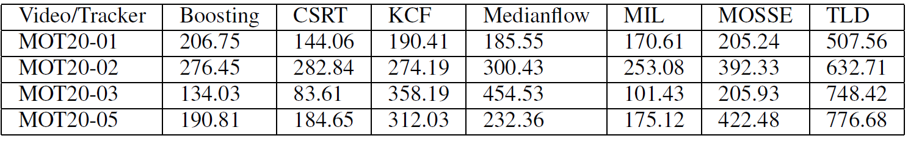

# Simply Object Tacking using OpenCV
Based on: https://gist.github.com/bajcmartinez/67a47d616e1805b81e54f4724358b8fe

## Pre-requisites
None - can run on CPU, no GPU required

## Setup
Activate the virtual env using the following commands.
```bash
%conda env create -f conda-gpu.yml
%conda activate opencv-tracking-v1
```

## Configuration
Within the main.ipynb the source of the video can be configured. The following sources are supported:
```python
    #video = cv2.VideoCapture("input.mp4")
    video = cv2.VideoCapture(0) # for using WebCam
```

## Components
### Detection
The bounding box is manually selected using the mouse. The bounding box is then tracked by OpenCV.

### Tracking
Based on the manually selected detection one of the following OpenCV algorithms can be used to track the selected object:

#### BOOSTING
Based on the AdaBoost algorithm which increases the weights of incorrectly classified objects. This methods allows a weak classifier to focus (boost) on their detection.

Since the classifier is trained “online”, the user sets the frame in which the tracking object is located. This object is initially treated as a positive result of detection, and objects around it are treated as the background.

Receiving a subsequent image frame, the classifier scores the surrounding detection pixels from the previous frame and the new position of the object will be the area where the score has the maximum value.

Pros:
- object is tracked quite accurately, even though the algorithm is already outdated.

Cons:
- relatively low speed
- strong sensitivity to noise and obstacles in the background
- inability to stop tracking when the object is lost

Based on [2]

#### MIL (Multiple Instance Learning)
The algorithm is based on the MIL algorithm, which is a generalization of the Boosting algorithm. The main difference is that the MIL algorithm does not only consider the current location of the object as a positive example, it looks in a small area around the object to generate several positive examples.

Using MIL one does not specify positive and negative examples, but positive and negative bags. The collection of images in the positive bag must not all be positive. In the example of OpenCV the positive bag contains the patch of the object and its surroundings. The negative bag contains the background.

Pros:
- more robust to noise
- shows fairly good accuracy.

Cons:
- relatively low speed
- impossibility of stopping tracking when the object is lost.

Based on [3]

#### KCF (Kernelized Correlation Filters)
Combines two the two BOOSTING and MIL.


The tracker build on the ideas of the previous ones. It utilizes the fact that within a set of images from a “bag” obtained by the MIL method have many overlapping areas. Correlation filtering applied to these areas makes it possible to track the movement of an object with high accuracy and to predict its further position.

Pros:
- sufficiently high speed and accuracy
- stops tracking when the tracked object is lost

Cons:
- inability to continue tracking after the loss of the object.

Based on [2] and [3]

#### TLD (Tracking, Learning and Detection)
This method allows you to decompose the task of tracking an object into three processes: 1) short term tracking, 2) learning and 3) detecting. The authors state that the tracker follows the object frame to frame and the detector localizes all appearances that have been observed so far and corrects the tracker if necessary.

The learning estimates detectors error and updates it to avoid these errors in the future.

Pros:
- shows relatively good results in terms of resistance to object scaling and overlapping by other objects.

Cons:
- rather unpredictable behavior, there is the instability of detection and tracking, constant loss of an object, tracking similar objects instead of the selected one.

#### MEDIANFLOW
This algorithm is based on the Lucas-Kanade method. The algorithm tracks the movement of the object in the forward and backward directions in time and estimates the error of these trajectories, which allows the tracker to predict the further position of the object in real-time.

Pros:
- sufficiently high speed and tracking accuracy, if the object isn’t overlapped by other objects and the speed of its movement is not too high.
- The algorithm quite accurately determines the loss of the object.

Cons:
- high probability of object loss at high speed of its movement.

Based on [2]

#### GOTURN (Generic Object Tracking Using Regression Networks)
This algorithm is an “offline” tracker since it basically contains a deep convolutional neural network. The previous and current image are fed into the neural network. In the previous image, the position of the object is known. For the current image the position of the object must be predicted. The output of the neural network is a set of 4 points representing the coordinates of the predicted bounding box containing the object. Since the algorithm is based on the use of a neural network, the user needs to download and specify the model and weight files for further tracking of the object.

Pros:
- comparatively good resistance to noise and obstructions.

Cons:
- the accuracy of tracking objects depends on the data on which the model was trained, which means that the algorithm may poorly track some objects selected by the user.
- Loses an object and shifts to another if the speed of the first one is too high.

Based on [2]

#### MOSSE (Minimum Output Sum of Squared Error)
Uses an adaptive correlation for object tracking which produces stable correlation filters when initialized using a single frame. This tracker is robust to changes in lighting, scale, pose, and non-rigid deformations of the object. It also detects occlusion, which enables the tracker to recover the object when it becomes visible again. Furthermore the tracker can operate at a high frame rate, which is important for real-time applications.

Pros:
- very high tracking speed, more successful in continuing tracking the object if it was lost.

Cons:
- high likelihood of continuing tracking if the subject is lost and does not appear in the frame.

Based on [2]

#### CSRT (Discriminative Correlation Filter with Channel and Spatial Reliability)
This algorithm uses spatial reliability maps for adjusting the filter support to the part of the selected region from the frame for tracking, which gives an ability to increase the search area and track non-rectangular objects. Reliability indices reflect the quality of the studied filters by channel and are used as weights for localization. It operates at lower fps (25-30) than other trackers.

Pros:
- among the previous algorithms it shows comparatively better accuracy, resistance to overlapping by other objects.

Cons:
- sufficiently low speed, an unstable operation when the object is lost.

Based on [2]

## Results using CSRT algorithm


## Evaluation
As a score IoU, precision and accuracy are used. IoU is quite intuitive to interpret. A score of 1 means that the predicted bounding box precisely matches the ground truth bounding box. A score of 0 means that the predicted and true bounding box do not overlap at all.


As it can be seen from the graph, is that CSRT algorithm has the highest average IoU score. This is due to the fact that the algorithm is able to track the object even if it is occluded by other objects. The algorithm is also able to track the object if it is partially occluded by other objects.

Average Precision


Boosting provides the highest average precision score.

Average Accuracy


CSRT provides the highest average accuracy score.

Therefore it can be concluded that CSRT is the best algorithm for tracking objects in videos.

Based on [Multiple Object Trackers in OpenCV: A Benchmark](https://www.semanticscholar.org/reader/9c1403b61d58b98e4d1b176014fade7b2d529387)

## Conclusion
Based on the above evaluation the following conclusions can be drawn:
- limited approach
- manual selection of the object to be tracked is required, therefore no object detection
- object classses can not be determined
- SOT approach is not suitable for real-time applications

## References
[1] https://livecodestream.dev/post/object-tracking-with-opencv/#:~:text=Object%20tracking%20using%20OpenCV%20is,CSRT%2C%20GOTURN%2C%20and%20MediandFlow

[2] https://broutonlab.com/blog/opencv-object-tracking

[3] https://learnopencv.com/object-tracking-using-opencv-cpp-python/

