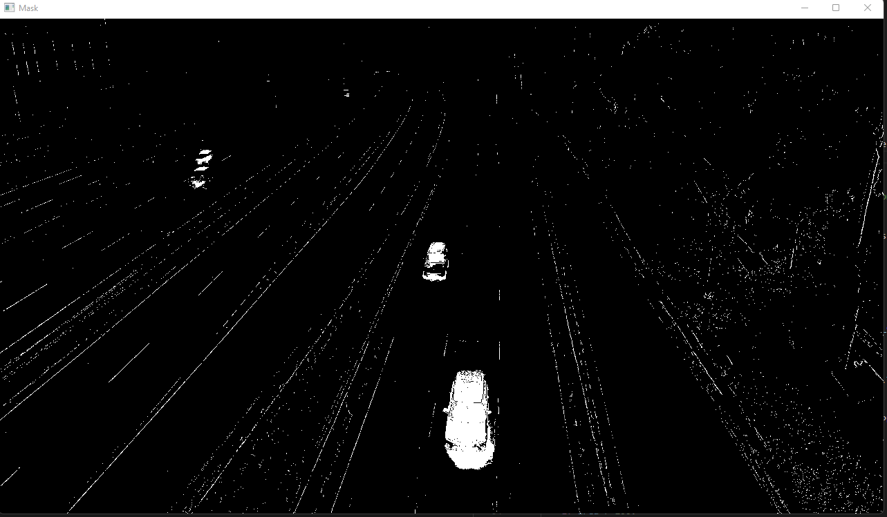
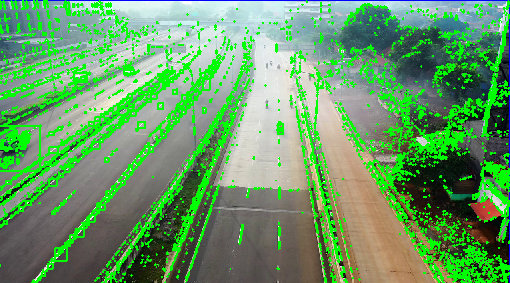

# Object Tracking with OpenCV using a Machine Learning approach

## Pre-requisites
OpenCV with CUDA support

## Setup
Activate the virtual env using the following commands.
```bash
%conda env create -f conda-gpu.yml
%conda activate opencv-tracking-v1
```

Furthermore OpenCV must be compiled with CUDA support. This can be done by following the instructions on the [Pre-Requisites Read Me](../_Prerequisite_OpenCV_CUDA/Readme.md).


All configurations for the app can be made within the [settings.py](settings.py) file.

## Components
### Detection
The detection uses the MOG2 background subtraction algorithm to detect moving objects. It is a Gaussian Mixture-based Segmentation algorithm.
The idea is that the longer the color stays the higher the probability that it is a part of the background. This information can be used to identify object and background within the image. The gaussian distribution helps this method to adapt to variance in illumination.

```python
# Object detection from Stable camera, extract the moving objects from the stable camera¨
# the longer the history the more stable the object detection is
# the higher the value less detection, but also less false positives
object_detector = cv2.createBackgroundSubtractorMOG2(history=settings.history, varThreshold=settings.varThreshold)
```

The class has the following parameters:
- history : Length of history. (Default=500). The history states how many previous frames are used to detect moving objects. The longer the history the more stable the object detection is. The higher the value less detection, but also less false positives.
- varThreshold : This value determines whether a pixel is well described by its background model. (Default=16).

Based on [2]

```python
# remove noise from the mask
_, mask = cv2.threshold(mask, settings.noise_threshold, 255, cv2.THRESH_BINARY)
```

Thresholding is used to remove noise from the mask. The threshold value is set to `settings.noise_threshold`. This means that all pixels with a value below `settings.noise_threshold` will be set to 0. All pixels with a value above `settings.noise_threshold` will be set to 255. This is done to remove noise from the mask.

`cv2.THRESH_BINARY` is used as maximum values which the pixels will be set of they are bigger than the threshold value. The processed image can be viewed bellow, only containing black and white pixels.



Within the above image it gets already clear that this method is not very accurate. The mask contains a lot of noise and the objects are not well defined. This is due to the fact that the background is not stable. The background is changing all the time due to the moving objects. This is why the MOG2 algorithm is not very accurate.

Without further processing the detections will look like this:


In the above image it can be seen that without further processing the detections are not very accurate and therefore not very useful.

To improve the detection a minimum area for a detection is set. This is done by using the `cv2.findContours` function. This function returns the contours of the objects within the image. The contours are then filtered based on the minimum area. The minimum area is set to `settings.min_area`. This means that all contours with an area below `settings.min_area` will be removed. The processed image can be viewed bellow.

```python
area = cv2.contourArea(cnt)
if area > settings.min_area:
    x, y, w, h = cv2.boundingRect(cnt)
    detections.append([x, y, w, h])
```

### Tracking
The tracker keeps track of all the objects that are detected. It uses the Euclidian Distance between the centroids of the bounding boxes to determine if the object is the same as the previous frame. If the distance is below a certain threshold the object is considered the same. If the distance is above the threshold the object is considered a new object.

## Results


## Evaluation

## References
[1] https://pysource.com/2021/01/28/object-tracking-with-opencv-and-python/
[2] https://www.authentise.com/post/segment-background-using-computer-vision
