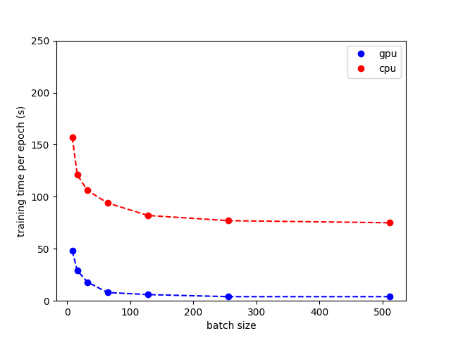
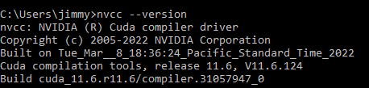

# Prerequisites
The neural network is performing badly when executed only on a CPU.
To improve the performance, a GPU is required. OpenCV supports CUDA and OpenCV but one is required to manually compile it. The neural network frameworks like Tensorflow and PyTorch support CUDA and OpenCL out of the box.


## Why GPU?
Neural networks are very computationally intensive computer models. The more complex the network, the more computation is required. The CPU is not designed for this kind of computation. The GPU is designed better suited for this kind of operation as it is a parallel processor. It can perform the same operation on multiple data points at the same time. The CPU is a serial processor and can therefore only perform one operation at a time.

Based on: https://www.weka.io/blog/cpu-vs-gpu/

This is why GPUs are better suited for neural networks. This finding can also be shown in the visualization bellow. In the visualization bellow a neural network is trained to mnist dataset. The mnist dataset is a dataset of handwritten digits. The neural networks is trained to recognize the digits. The visualization shows the time it takes to train the neural network on a CPU and a GPU. The GPU is clearly faster than the CPU.

Based on: http://yann.lecun.com/exdb/mnist/



The above case is a very simple neural network. The more complex the neural network, the more computation is required. Furthermore within this project we are also working with a video stream. This means that the neural network has to be executed multiple times per second. This requirements lead to the conclusion that a GPU is required to improve the performance of the neural network.

Based on the findings of the following [Jupyter Notebook](../GPU_CPU_Comparision.ipynb)

## How it works - Tensorflow
Tensorflow is supported by CUDA and cuDNN. The GPU is automatically detected if the libraries are installed correctly. Therefore one is required to install the compatible CUDA and cuDNN libraries as described in the [Tensorflow documentation](https://www.tensorflow.org/install/pip).

***Prerequisites***

Install Microsoft Visual C++ Redistributable for Visual Studio 2015, 2017 and 2019. The source can be found [here](https://support.microsoft.com/en-us/help/2977003/the-latest-supported-visual-c-downloads).

***Installation***

The following conda packages must be used, exactly matching the version mentioned within the TensorFlow documentation. The current Tensorflow Version 2.10 is the last version supporting Windows Native installation. Further versions are only available as a WSL installation.
>Caution: The current TensorFlow version, 2.10, is the last TensorFlow release that will support GPU on native-Windows. Starting with TensorFlow 2.11, you will need to install TensorFlow in WSL2, or install tensorflow_cpu and, optionally, try the TensorFlow-DirectML-Plugin

The installation can be either done via the following conda command or by the provided virtual environment.

```bash
conda install -c conda-forge cudatoolkit=11.2 cudnn=8.1.0
python3 -m pip install tensorflow

# Verify install:
python3 -c "import tensorflow as tf; print(tf.config.list_physical_devices('GPU'))"
```

## How it works - PyTorch
PyTorch is supported by CUDA and cuDNN. The GPU is automatically detected if the libraries are installed correctly. Therefore one is required to install the compatible CUDA and cuDNN libraries as described in the [PyTorch documentation](https://pytorch.org/get-started/locally/).

Here it is important to note, that the version of CUDA and cuDNN must match the version of PyTorch. In our case PyTorch 1.12.1 is used. This PyTorch version requires CUDA 11.6 and cuDNN 8.4.1. Therefore the following versions must be installed.

***Prerequisites***

- Installing the CUDA 11.6 Toolkit by downloading the corresponding installer from the [CUDA Toolkit Archive](https://developer.nvidia.com/cuda-toolkit-archive) and running the installer.
- Installing the cuDNN 8.4.1 Library for Windows by downloading the corresponding installer from the [cuDNN Archive](https://developer.nvidia.com/rdp/cudnn-archive) and extracting the files to the CUDA Toolkit installation directory (e.g C:\C:\Program Files\NVIDIA GPU Computing Toolkit\CUDA\v11.6).

***Installation***

The installation can be either done via the following conda command or by the provided virtual environment.

```bash
conda install pytorch torchvision torchaudio cudatoolkit=11.6 -c pytorch -c conda-forge
```

```python
# verifying the installation
import torch
torch.cuda.is_available()
```

## How it works - Build CUDA enabled Open-CV
The OpenCV library is not supported by CUDA and OpenCL out of the box. Therefore one is required to compile it manually. The following steps are required to compile OpenCV with CUDA and OpenCL support.
1) Download and install python (recommended to use anaconda)
2) Download and install Visual Studio 2019 Community Edition. During the setup of Visual Studio enable the feature "Destkop development with C++".
3) Download [Cuda](https://developer.nvidia.com/cuda-11.0-download-archive?target_os=Windows&target_arch=x86_64) for Windows 10. Make sure to download the correct version for your system. The version used for this project is 11.6.
4) Download [cuDNN](https://developer.nvidia.com/rdp/cudnn-archive#a-collapse805-110) for Windows 10. Ensure that you select the version which is compatible with CUDA. The version used for this project is 8.4.1. Once downloaded extract the cuDNN files. Copy the content of the files to the root of the NVIDIA CUDA toolkit (e.g C:\Program Files\NVIDIA GPU Computing Toolkit\CUDA\v11.6). Replace the files if prompted.
5) Download and install [cmake](https://cmake.org/download/).
6) Create a OpenCV WORK folder.
7) Download the source files of the latest [OpenCV](https://opencv.org/releases/) and extract the files to the WORK folder.
8) Download opencv_contrib from [GitHub](https://github.com/opencv/opencv_contrib/tags) and extract the files to the WORK folder. Ensure that the version is compatible with the version of OpenCV. In our case OpenCV 4.6.0 is used. Therefore the version of opencv_contrib is 4.6.0.
9) Open cmake GUI and select the extracted opencv source folder as the source folder.
10) Create a new folder as build and select it as the WORK folder.
11) Hit configure and select Visual Studio 2019 as the generator and x64 as architecture.
12) Enable the following configurations
- WITH_CUDA
- OPENCV_DNN_CUDA
- ENABLE_FAST_MATH
- BUILD_opencv_world
- OPENCV_EXTRA_MODULES_PATH=<WORK\opencv_contrib\modules>
13) Hit configure.
14) Enable the following configuration
- CUDA_ARCH_BIN=<6.1> # based on the GPU you have, see [wiki](https://en.wikipedia.org/wiki/CUDA) for more information
- CUDA_FAST_MATH
15) Hit generate.
16) Use the following command to build the library:
```
"C:\Program Files\CMake\bin\cmake.exe" --build "C:\WORK\build" --target INSTALL --config Release
```

## CUDA
CUDA has two APIs, the CUDA Runtime API and the CUDA Driver API.

The CUDA Runtime API is a higher-level API that is easier to use and is the recommended API for most applications. The CUDA Driver API is a lower-level API that provides more control over the GPU and is required for some applications. The CUDA Runtime API is a wrapper around the CUDA Driver API. The CUDA Runtime API is implemented in the CUDA libraries, which are installed with the CUDA Toolkit. The CUDA Driver API is implemented in the NVIDIA driver, which is installed with the GPU driver.

Based on: https://docs.nvidia.com/cuda/cuda-runtime-api/driver-vs-runtime-api.html

The `nvidia-smi` tool gets installed by the GPU driver installer and displays the GPU information. The CUDA version displayed within this tool is the version of the driver api and has no connection to the CUDA runtime version.

The `nvcc` CUDA compiler-driver tool is installed with the CUDA toolkit, will always report the CUDA runtime version that it was built to recognize. This version is independent of the CUDA driver version.

### Changing CUDA Version
In this project you are required to switch between CUDA versions 11.6 and 11.2. This can be done by changing the CUDA_HOME environment variable. The CUDA_HOME environment variable is used by the CUDA compiler driver (nvcc) to locate the CUDA Toolkit installation. The CUDA_HOME environment variable is also used by the CUDA runtime to locate the CUDA Toolkit installation. Initially the CUDA_HOME environment variable is set by the CUDA Toolkit installer.

## Step 0: Check CUDA Version
Check what version of CUDA you have. You can enter this to any command prompt (cmd, anaconda, etc)
```bash
nvcc --version
```

Output should look something like this:


Then it means you have CUDA installed. And in my case, it's CUDA 11.6. I will be swapping to CUDA 11.3 in the following steps.

## Step 1: Change System Variables
Open the system variables by searching for "environment variables" in the windows search bar. Then click "Environment Variables" button and you should be able to see the user and system environment variables.

Check if the env variable `CUDA_PATH` already exists, otherwise create a new variable.

Change the content of the variable to the CUDA installation path. In this case, it's `C:\Program Files\NVIDIA GPU Computing Toolkit\CUDA\v11.6`.

## Step 3: Change System Paths
Ensure that within the PATH environment variable the selected CUDA version is the first entry. In this case, it's `C:\Program Files\NVIDIA GPU Computing Toolkit\CUDA\v11.6\[bin, libnvvp]`.

## Step 3: Check if succeed
Close all command prompt and open a new one. Then check the CUDA version again by entering the following command:
```bash
nvcc --version
```
