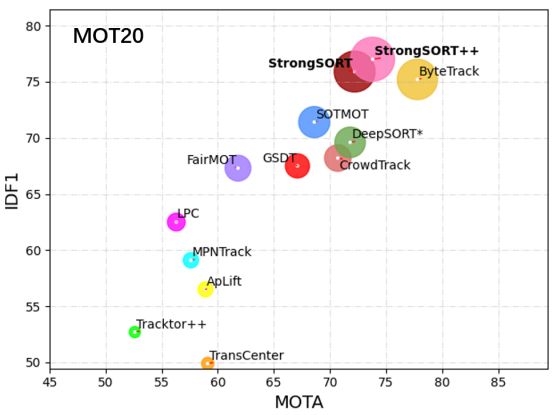

# Object Detectors (Smart Checkpoints)
## How it works

## Design
### Object detection
General object detection is based on the following steps:
1. Firstly create background and ignore small objects
2. Define region of interest
3. Add threshold function to detect objects within region of interest

The following object detection algorithms are analyzed in this project:
- OpenCV Background Subtraction - [OpenCV-Tracking-V2](./OpenCV-Tracking-V2/Readme.md)
- YOLOV4 - [OpenCV-Tracking-V3](./OpenCV-Tracking-V3/Readme.md)
- YOLOV3 - [OpenCV-Tracking-V4](./OpenCV-Tracking-V4/Readme.md)
- YOLOV5 - [OpenCV-Tracking-V5](./OpenCV-Tracking-V5/Readme.md)

### Object tracking
Object tracking is required as within the realms of video we have a sequences of images (frames) together. These images are related to each other and therefore we can use the information from the previous frame to help us in the current frame. This added temporal dimension requires the usage of object tracking methods.

Object tracking is one such application of computer vision where an object is detected in a video, otherwise interpreted as a set of frames, and the object’s trajectory is estimated. There are two different types of object tracking:
- Single Object Tracking (SOT): where only one object is tracked
- Multiple Object Tracking (MOT): where multiple objects are tracked

General object tracking solutions are based on the following steps:
- target initialization: receive bounding boxes from object detection step, the tracker must then estimate or predict the objects position in the remaining frames
- Appearance modelling: modeling the visual appearance (lighting condition, angle, speed) of the object. Appearance modeling has to be conducted so that modeling algorithms can capture various changes and distortions introduced when the target object moves. One one hand one can focus on visual representation of the objects. Here the goal is to construct robust features and representation that describe these visual characteristics. On the other hand one can focus on mathematical models. Here the goal is to apply statics and dynamics to create robust features to detect the object.
- Motion estimation: infers the predictive capability of the model to predict the object’s future position accurately.
- target positioning: approximates the possible region where the object could most likely be present

based on [3]

An object tracking algorithm is expected to detect and localize the object in a video in a fraction of a second and with high accuracy. The object to be detected can vary by size and / or rotation within the subsequent frames. Additional complexity is added by limited visibilities such as motion blur, variation in the illumination, or low resolution. Lastly the composition of the image itself such as viewpoint or cluttering of similar objects in the background can make this task even more difficult. Some of the most important challenges are described in the chapter challenges.

Based on [1]

The following tracking algorithms are analyzed:
- OpenCV - Various BuiltIn Tracker [OpenCV-Tracking-V1](./OpenCV-Tracking-V1/Readme.md)
- OpenCV - Self Developed Euclidian Distance [OpenCV-Tracking-V2](./OpenCV-Tracking-V2/Readme.md) or [OpenCV-Tracking-V3](./OpenCV-Tracking-V3/Readme.md)
- [FairMot](https://github.com/ifzhang/FairMOT) -  (not implement within this project)
- [ByteTrack](https://github.com/ifzhang/ByteTrack) - (not implemented within this project)
- [DeepSort](https://github.com/nwojke/deep_sort) - Simple Online and Realtime Tracking with a Deep Association Metric [OpenCV-Tracking-V4](./OpenCV-Tracking-V4/Readme.md): one of the most widely used object tracking architectures
- [StrongSORT](https://github.com/dyhBUPT/StrongSORT) with [OSNet](https://github.com/mikel-brostrom/Yolov5_StrongSORT_OSNet) [OpenCV-Tracking-V5](./OpenCV-Tracking-V5/Readme.md): within this project the most performant object tracker. Therefore this tracker is used for the final implementation.

The above list is based on the results of the [MOT20](https://motchallenge.net/results/MOT20/?det=All) benchmark and public available implementation of these algorithms within GitHub.

This project heavily relies on the information of this article: https://arxiv.org/pdf/2202.13514.pdf

Based on [2]

### OpenCV - Various Tracker and Euclidian Distance [OpenCV-Tracking-V1](./OpenCV-Tracking-V1/Readme.md), [OpenCV-Tracking-V2](./OpenCV-Tracking-V2/Readme.md) or [OpenCV-Tracking-V3](./OpenCV-Tracking-V3/Readme.md)
Since today, OpenCV has been used in several mainstream applications, including object detection and recognition, autonomous cars and robots, automated surveillance, anomaly detection, video and image search retrieval, medical image analysis, and object tracking. It is a highly optimized library with focus on real-time applications. It has C++, C, Python and Java interfaces and supports Windows, Linux, Mac OS, iOS and Android. OpenCV was designed for computational efficiency and with a strong focus on real-time applications. Written in optimized C/C++, the library can take advantage of multi-core processing. Adopted all around the world, the library is used extensively in companies, research groups and by governmental bodies.

Based on [4]

***OpenCV - Various Tracker***

OpenCV provides a number of built-in tracker algorithms. See [OpenCV-Tracking-V1](./OpenCV-Tracking-V1/Readme.md) for more details.

***OpenCV - Euclidian Distance***

Is based on the assumption that the object is moving in a straight line. Therefore the distance between the current and the previous position is calculated. If the distance is below a certain threshold the object is considered to be the same object. If the distance is above the threshold a new object is created.

The algorithm is based on the following steps:
- Step 1. Takes Bounding boxes coordinates of detected objects and computes centroid by using bounding box’s coordinates.
- Step 2. For every subsequent frame, it computes the centroid using bounding box coordinates and assigns an id to those bounding boxes, and computes the Euclidian distance between every centroid possible.
- Step 3. Our assumption is that a given object will potentially move in subsequent frames, and the Euclidean distance between their centroid will be the minimum distance compared to others.
- Step 4. Assign the same IDs to the minimum moved centroid in between subsequent frames, and if the distance is greater than a threshold, then assign a new ID to the centroid.

Based on [6]

### CrowdTrack
The model combines all steps required for object tracking within a single neural network. The researchers implemented a powerful baseline which outperformed state of the art methods on the MOT challege. The model reached 30 FPS on the dataset.

### ByteTrack
Multi-object tracking (MOT) aims at estimating bounding boxes and identities of objects in videos. Most methods obtain identities by associating detection boxes whose scores are higher than a threshold. The objects with low detection scores, e.g. occluded objects, are simply thrown away, which brings non-negligible true object missing and fragmented trajectories.

TO address this issue, the researchers propose a simple, but effective method, tracking by associating every detection box instead of only the high score ones. For the low score detection boxes, their similarities with tracklets are being used to recover true objects and filter out background detections.

The tracker performs a 80.3 MOTA, 77.3 IDF1 and 63.1 HOTA on the test set of MOT17 with 30 FPS running speed on a single V100 GPU.

Based on [8]

### DeepSort - Deep Simple Online Real-time Tracker [OpenCV-Tracking-V4](./OpenCV-Tracking-V4/Readme.md)
Is an extension of SORT which improves the matching procedures and reduces the number of identity switches by adding visual appearance descriptor or appearance features. Therefore it obtains higher accuracy with the use of motion measurement and appearance features.

DeepSORT is one of the most popular object tracking algorithms. It is an extension to Simple Online Real-time Tracker or SORT, which is an online-based tracking algorithm.
SORT is an algorithm that uses the Kalman filter for estimating the location of the object given the previous location of the same. The Kalman filter is very effective against the occlusions.

SORT comprises of three components:
Detection: Detecting the object of interest in the initial stage i.
Estimation: Predicting the future location i+1 of the object from the initial stage using the Kalman filter. It is worth noting that the Kalman filter just approximates the object’s new location, which needs to be optimized.
Association: As the Kalman filter estimates the future location of the object i+1, it needs to be optimized using the correct position. This is usually done by detecting the position of the object in that position i+1. The problem is solved optimally using the Hungarian algorithm.
Deep neural networks allow SORT to estimate the object’s location with much higher accuracy because these networks can now describe the features of the target image.
Essentially, the CNN classifier is trained on a task-specific dataset until it achieves good accuracy. Once it is achieved, the classifier is stripped, and we are left with only the features extracted from that dataset. This extracted feature is then incorporated with the SORT algorithm to track objects.

Based on [3]

### StrongSORT with OSNet [OpenCV-Tracking-V5](./OpenCV-Tracking-V5/Readme.md)

StrongSORT combines motion and appearance information based on OSNet in order to tracks the objects. It can track any object that your Yolov5 model was trained to detect.

***StrongSort***

Existing Multi-Object Tracking (MOT) methods can be roughly classified as tracking-by-detection and joint-detection-association paradigms. Although the latter has elicited more attention and demonstrates comparable performance relative to the former, we claim that the tracking-by-detection paradigm is still the optimal solution in terms of tracking accuracy. In this paper, we revisit the classic tracker DeepSORT and upgrade it from various aspects, i.e., detection, embedding and association. The resulting tracker, called StrongSORT, sets new HOTA and IDF1 records on MOT17 and MOT20. We also present two lightweight and plug-and-play algorithms to further refine the tracking results. Firstly, an appearance-free link model (AFLink) is proposed to associate short tracklets into complete trajectories. To the best of our knowledge, this is the first global link model without appearance information. Secondly, we propose Gaussian-smoothed interpolation (GSI) to compensate for missing detections. Instead of ignoring motion information like linear interpolation, GSI is based on the Gaussian process regression algorithm and can achieve more accurate localizations. Moreover, AFLink and GSI can be plugged into various trackers with a negligible extra computational cost (591.9 and 140.9 Hz, respectively, on MOT17). By integrating StrongSORT with the two algorithms, the final tracker StrongSORT++ ranks first on MOT17 and MOT20 in terms of HOTA and IDF1 metrics and surpasses the second-place one by 1.3 - 2.2. Code will be released soon.

Based on [7]

## Terminology
***Image Tracking***

Image tracking is the task of automatically recognizing and tracking objects within an image.

***Video Tracking***

Video tracking is the task of tracking a moving object in a video. The idea of video tracking is to associate or establish a relationship between target objects as they appear in each video frame. In other words, video tracking is analyzing the video frames sequentially and stitching the past location of the object with the present location by predicting and creating a bounding box around it.

Based on [1]

***Identity Switching***

Identity switching is a problem in object tracking where the tracker assigns a new identity to an object that has already been tracked. This can happen when the tracker loses track of an object and then re-identifies it as a new object.

Based on [1]

## Challenges
In the following section, we will discuss the challenges that are faced while tracking objects in a video.

***Occlusion***

Is an interference phenomenon where the object is affected by the background or foreground in which the tracking algorithm loses track of the object. The algorithm gets confused as multiple objects come closer as they start to overlap. One can implement occlusion sensitivity to prevent it.

***Background Clutter***

In theory, the more densely populated the background, the more difficult it is to extract features, detect or even track the object of interest. A densely populated background introduces redundant information or noise that makes the network less receptive to features that are important; they also make the network slow to learn and optimize. To prevent background clutter, one can use a well-curated dataset that has a sparse background.

***Training and Tracking Speed***

It is a multitask algorithm that performs object detection, localization, classification and also keeps track of the objects. This type of algorithm is mathematically complex, and it takes a lot of time to train. Enhancing tracking speed is especially imperative for real-time object tracking models.

Based on [3]

## Development
### Prerequisite
Please read the prerequisite [readme.md](https://github.com/jimmylevell/crowd-overview/blob/master/ObjectCounter/readme.md).

### Virtual ENVs
For this project, we will be using virtual environments. This is a tool that helps to keep dependencies required by different projects separate by creating isolated python virtual environments for them. It solves the “Project X depends on version 1.x but, Project Y needs 4.x” dilemma, and keeps your global site-packages directory clean and manageable.

### Test Data Sets

## Performance Overview
### Object Detection

### Object Tracking
Within the following graph the most resent object tracking algorithms are shown according to their performance. The horizontal axis is MOTA, the vertical axis is IDF1, and the radius of the circle is HOTA

based on: https://arxiv.org/pdf/2202.13514.pdf

As evaluation dataset the MOT challenge was being used. The MOT challenge is a benchmark for the detection of pedestrians. This benchmark contains 8 challenging video sequences (4 train, 4 test) in unconstrained environments. Tracking and evaluation are done in image coordinates. All sequences have been annotated with high accuracy, strictly following a well-defined protocol.

based on https://motchallenge.net/data/MOT20/

## Production

## References
[1] https://towardsdatascience.com/ug-vod-the-ultimate-guide-to-video-object-detection-816a76073aef

[2] https://livecodestream.dev/post/object-tracking-with-opencv/#:~:text=Object%20tracking%20using%20OpenCV%20is,CSRT%2C%20GOTURN%2C%20and%20MediandFlow

[3] https://www.v7labs.com/blog/object-tracking-guide

[4] https://opencv.org/

[5] https://pysource.com/2021/01/28/object-tracking-with-opencv-and-python/

[6] https://www.analyticsvidhya.com/blog/2022/04/building-vehicle-counter-system-using-opencv/

[7] https://github.com/dyhBUPT/StrongSORT

[8] https://kaiyangzhou.github.io/deep-person-reid/

[9] https://github.com/ifzhang/ByteTrack
