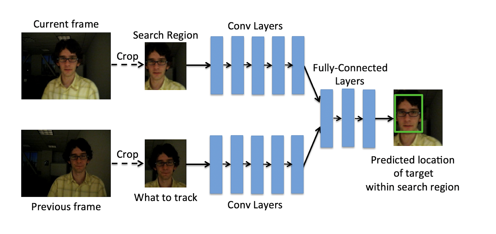

# Object Detectors (Smart Checkpoints)
## How it works

## Design
### Object detection
General object detection is based on the following steps:
1. Firstly create background and ignore small objects
2. Define region of interest
3. Add threshold function to detect objects within region of interest

The following object detection algorithms are analyzed in this project:
- OpenCV Background Subtraction - [OpenCV-Tracking-V2](./OpenCV-Tracking-V2/Readme.md)
- YOLOV4 - [OpenCV-Tracking-V3](./OpenCV-Tracking-V3/Readme.md)
- YOLOV3 - [OpenCV-Tracking-V4](./OpenCV-Tracking-V4/Readme.md)
- YOLOV5 - [OpenCV-Tracking-V5](./OpenCV-Tracking-V5/Readme.md)

### Object tracking
Object tracking is required as within the realms of video we have a sequences of images (frames) together. These images are related to each other and therefore we can use the information from the previous frame to help us in the current frame. This added temporal dimension requires the usage of object tracking methods.

Object tracking is one such application of computer vision where an object is detected in a video, otherwise interpreted as a set of frames, and the object’s trajectory is estimated. There are two different types of object tracking:
- Single Object Tracking (SOT): where only one object is tracked
- Multiple Object Tracking (MOT): where multiple objects are tracked

General object tracking solutions are based on the following steps:
- target initialization: receive bounding boxes from object detection step, the tracker must then estimate or predict the objects position in the remaining frames
- Appearance modelling: modeling the visual appearance (lighting condition, angle, speed) of the object. Appearance modeling has to be conducted so that modeling algorithms can capture various changes and distortions introduced when the target object moves. One one hand one can focus on visual representation of the objects. Here the goal is to construct robust features and representation that describe these visual characteristics. On the other hand one can focus on mathematical models. Here the goal is to apply statics and dynamics to create robust features to detect the object.
- Motion estimation: infers the predictive capability of the model to predict the object’s future position accurately.
- target positioning: approximates the possible region where the object could most likely be present

based on [3]

An object tracking algorithm is expected to detect and localize the object in a video in a fraction of a second and with high accuracy. The object to be detected can vary by size and / or rotation within the subsequent frames. Additional complexity is added by limited visibilities such as motion blur, variation in the illumination, or low resolution. Lastly the composition of the image itself such as viewpoint or cluttering of similar objects in the background can make this task even more difficult. Some of the most important challenges are described in the chapter challenges.

Based on [1]

The following tracking algorithms are analyzed:
- OpenCV - Various BuiltIn Tracker [OpenCV-Tracking-V1](./OpenCV-Tracking-V1/Readme.md)
- OpenCV - Self Developed Euclidian Distance [OpenCV-Tracking-V2](./OpenCV-Tracking-V2/Readme.md) or [OpenCV-Tracking-V3](./OpenCV-Tracking-V3/Readme.md)
- MDNET - Multi-Domain Convolutional Neural Network Tracker (no implementation in this project)
- ROLO - Recurrent YOLO: A Fast and Accurate Recurrent Neural Network for Video Object Detection and Tracking (no implementation in this project)
- GOTURN - Generic Object Tracking Using Regression Networks (no implementation in this project)
- DeepSort - Simple Online and Realtime Tracking with a Deep Association Metric [OpenCV-Tracking-V4](./OpenCV-Tracking-V4/Readme.md): one of the most widely used object tracking architectures
- StrongSORT with OSNet [OpenCV-Tracking-V5](./OpenCV-Tracking-V5/Readme.md): within this project the most performant object tracker. Therefore this tracker is used for the final implementation.

Based on [2]

### OpenCV - Various Tracker and Euclidian Distance [OpenCV-Tracking-V1](./OpenCV-Tracking-V1/Readme.md), [OpenCV-Tracking-V2](./OpenCV-Tracking-V2/Readme.md) or [OpenCV-Tracking-V3](./OpenCV-Tracking-V3/Readme.md)
Since today, OpenCV has been used in several mainstream applications, including object detection and recognition, autonomous cars and robots, automated surveillance, anomaly detection, video and image search retrieval, medical image analysis, and object tracking. It is a highly optimized library with focus on real-time applications. It has C++, C, Python and Java interfaces and supports Windows, Linux, Mac OS, iOS and Android. OpenCV was designed for computational efficiency and with a strong focus on real-time applications. Written in optimized C/C++, the library can take advantage of multi-core processing. Adopted all around the world, the library is used extensively in companies, research groups and by governmental bodies.

Based on [4]

***OpenCV - Various Tracker***
See [OpenCV-Tracking-V1](./OpenCV-Tracking-V1/Readme.md) for more details.

***OpenCV - Euclidian Distance***
Is based on the assumption that the object is moving in a straight line. Therefore the distance between the current and the previous position is calculated. If the distance is below a certain threshold the object is considered to be the same object. If the distance is above the threshold a new object is created.

The algorithm is based on the following steps:
- Step 1. Takes Bounding boxes coordinates of detected objects and computes centroid by using bounding box’s coordinates.
- Step 2. For every subsequent frame, it computes the centroid using bounding box coordinates and assigns an id to those bounding boxes, and computes the Euclidian distance between every centroid possible.
- Step 3. Our assumption is that a given object will potentially move in subsequent frames, and the Euclidean distance between their centroid will be the minimum distance compared to others.
- Step 4. Assign the same IDs to the minimum moved centroid in between subsequent frames, and if the distance is greater than a threshold, then assign a new ID to the centroid.

Based on [6]

### MDNET
Multi-Domain Net is a type of object tracking algorithm which leverages large-scale data for training. Its objective is to learn vast variations and spatial relationships.
MDNet consists of pretraining and online visual tracking:
- Pretraining: In pretraining, the network is required to learn multi-domain representation. To achieve this, the algorithm is trained on multiple annotated videos to learn representation and spatial features.
- Online visual tracking: Once pre-training is done, the domain-specific layers are removed and the network is only left with shared layers, which consist of learned representations. During inference, a binary classification layer is added, which is trained or fine-tuned online.

This technique saves time as well as it has proven to be an effective online-based tracking algorithm.

Based on [3]

### ROLO - ROLO—Recurrent YOLO
ROLO combines two types of neural networks: one is CNN which is used to extract spatial information while the other is an LSTM network which is used for finding the trajectory of the target object.

At each time step, spatial information is extracted and sent to the LSTM, which then returns the location of the tracked object.

We can use the above diagram to understand how ROLO works:
The video sequence is fed into the YOLO architecture which is primarily made of CNN, here features are extracted as well as bounding boxes are detected.
The visual features and bounding boxes are then concatenated and fed to the LSTM
The LSTM then predicts the trajectory of the objects.

Based on [3]

### GOTURN - Generic Object Tracking Using Regression Networks
Deep Regression Networks are offline training-based models. This algorithm learns a generic relationship between object motion and appearance and can be used to track objects that do not appear in the training set.

Online tracker algorithms are slow and do not perform well in real-time. This is due there inability to take advantage of a large number of videos to improve their performance during training.

Offline tracker algorithms, on the other hand, can be trained to handle rotations, changes in viewpoint, lighting changes, and other complex challenges.

***Generic Object Tracking Using Regression Networks*** or GOTURN uses a regression-based approach to tracking objects. Essentially, they regress directly to locate target objects with just a single feed-forward pass through the network. The input of the network is a search region from the ***current*** frame and a target from the ***previous*** frame. The network then compares these images to find the target object in the current image.

Based on [3]

### DeepSort - Deep Simple Online Real-time Tracker [OpenCV-Tracking-V4](./OpenCV-Tracking-V4/Readme.md)
Is an extension of SORT which improves the matching procedures and reduces the number of identity switches by adding visual appearance descriptor or appearance features. Therefore it obtains higher accuracy with the use of motion measurement and appearance features.

DeepSORT is one of the most popular object tracking algorithms. It is an extension to Simple Online Real-time Tracker or SORT, which is an online-based tracking algorithm.
SORT is an algorithm that uses the Kalman filter for estimating the location of the object given the previous location of the same. The Kalman filter is very effective against the occlusions.

SORT comprises of three components:
Detection: Detecting the object of interest in the initial stage i.
Estimation: Predicting the future location i+1 of the object from the initial stage using the Kalman filter. It is worth noting that the Kalman filter just approximates the object’s new location, which needs to be optimized.
Association: As the Kalman filter estimates the future location of the object i+1, it needs to be optimized using the correct position. This is usually done by detecting the position of the object in that position i+1. The problem is solved optimally using the Hungarian algorithm.
Deep neural networks allow SORT to estimate the object’s location with much higher accuracy because these networks can now describe the features of the target image.
Essentially, the CNN classifier is trained on a task-specific dataset until it achieves good accuracy. Once it is achieved, the classifier is stripped, and we are left with only the features extracted from that dataset. This extracted feature is then incorporated with the SORT algorithm to track objects.

Based on [3]

### StrongSORT with OSNet [OpenCV-Tracking-V5](./OpenCV-Tracking-V5/Readme.md)

Based on [5]

## Terminology
***Image Tracking***

Image tracking is the task of automatically recognizing and tracking objects within an image.

***Video Tracking***

Video tracking is the task of tracking a moving object in a video. The idea of video tracking is to associate or establish a relationship between target objects as they appear in each video frame. In other words, video tracking is analyzing the video frames sequentially and stitching the past location of the object with the present location by predicting and creating a bounding box around it.

Based on [1]

## Challenges
In the following section, we will discuss the challenges that are faced while tracking objects in a video.

***Occlusion***

Is an interference phenomenon where the object is affected by the background or foreground in which the tracking algorithm loses track of the object. The algorithm gets confused as multiple objects come closer as they start to overlap. One can implement occlusion sensitivity to prevent it.

***Background Clutter***

In theory, the more densely populated the background, the more difficult it is to extract features, detect or even track the object of interest. A densely populated background introduces redundant information or noise that makes the network less receptive to features that are important; they also make the network slow to learn and optimize. To prevent background clutter, one can use a well-curated dataset that has a sparse background.

***Training and Tracking Speed***

It is a multitask algorithm that performs object detection, localization, classification and also keeps track of the objects. This type of algorithm is mathematically complex, and it takes a lot of time to train. Enhancing tracking speed is especially imperative for real-time object tracking models.

Based on [3]

## Development
### Prerequisite
Please read the prerequisite [readme.md](https://github.com/jimmylevell/crowd-overview/blob/master/ObjectCounter/readme.md).

### Virtual ENVs
For this project, we will be using virtual environments. This is a tool that helps to keep dependencies required by different projects separate by creating isolated python virtual environments for them. It solves the “Project X depends on version 1.x but, Project Y needs 4.x” dilemma, and keeps your global site-packages directory clean and manageable.

### Test Data Sets

## Performance Overview
### Object Detection

### Object Tracking

## Production

## References
[1] https://towardsdatascience.com/ug-vod-the-ultimate-guide-to-video-object-detection-816a76073aef
[2] https://livecodestream.dev/post/object-tracking-with-opencv/#:~:text=Object%20tracking%20using%20OpenCV%20is,CSRT%2C%20GOTURN%2C%20and%20MediandFlow
[3] https://www.v7labs.com/blog/object-tracking-guide
[4] https://opencv.org/
[5] https://pysource.com/2021/01/28/object-tracking-with-opencv-and-python/
[6] https://www.analyticsvidhya.com/blog/2022/04/building-vehicle-counter-system-using-opencv/
