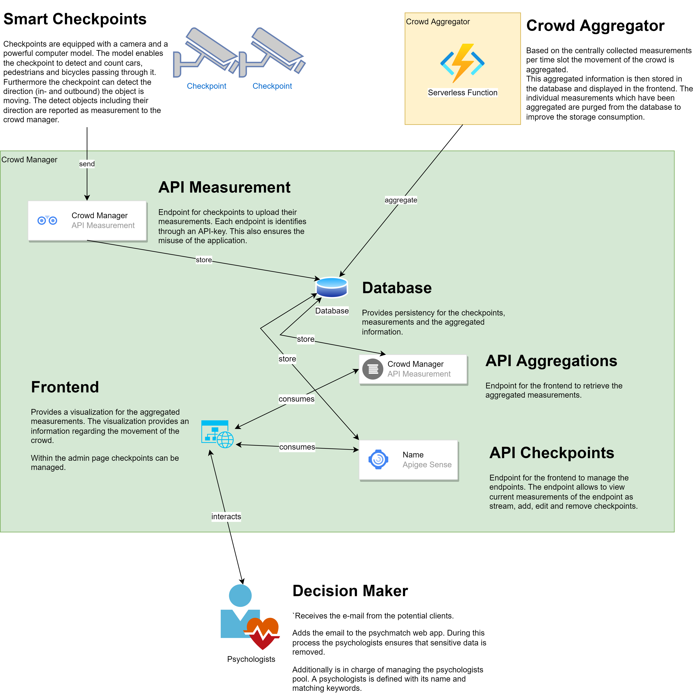
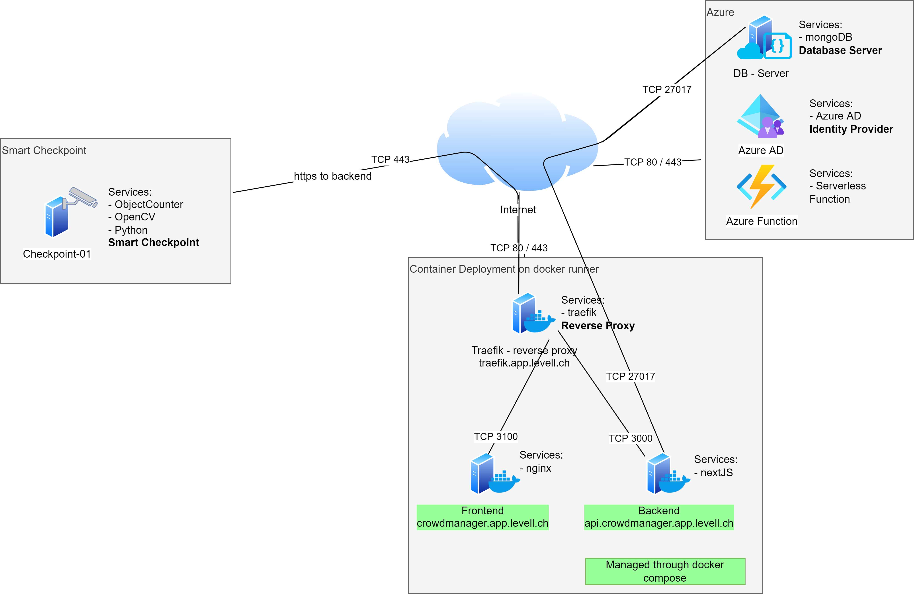

# Master Thesis
[](https://github.com/jimmylevell/crowd-overview/actions/workflows/action.yml)

**Crowd Flow Monitoring – Visualizing crowd movements using information captured on checkpoints**

## Big Picture
### Schematic Visualization
The following visualization displays the general idea of the project and the different components.


### Components
This mono repository contains the following four important components. Each component has an individual readme explaining further details of the component.

#### Components - Smart Checkpoints (ObjectCounter) - [Repo](https://github.com/jimmylevell/crowd-overview/tree/master/ObjectCounter)
A checkpoint is equipped with a sensor and a processing unit. The processing unit should use the information captured on the sensor to detect the objects and their direction. The collected information must then be sent over a secure channel via the internet to the central web application. The hardware for the checkpoint should be evaluated through this assignment. For both the processing unit and the sensor existing hardware should be used. This assignment focuses on the creation of the software component of the intelligent checkpoint.

Technology: OpenCV, Python, Yolov, DeepSort

#### Components - Web Application (CrowdManager) - [Repo](https://github.com/jimmylevell/crowd-overview/tree/master/CrowdManager)
A traditional frontend and backend web application should be developed. The communication between the two components should be only over secured and well-defined REST endpoints.
The frontend should allow the user to add new and modify existing checkpoints. Furthermore, the user should have a possibility to see the individual measurements from a single checkpoint. The information are periodically aggregated by the CrowdAggregator. The web application should display these aggregated information to a single visualization allowing to capture the movement of the crowd.

The application should be deployed as a containerized application using an CI / CD pipeline.

Technology used: NextJS, React, BootStrap

#### Components - Aggregation (CrowdAggregator) - [Repo](https://github.com/jimmylevell/crowd-overview/tree/master/CrowdAggregator)
The CrowdAggregator is a service that aggregates the information from the checkpoints. The information is aggregated in a time interval of 5 minutes. The aggregated information is then stored in a database. The information is then used by the web application to display the aggregated information.

Technology: JavaScript, Azure Function

#### Components - Database (MongoDB)
The document database should provide persistency for the individual measurements and the aggregations. The database is only communicating with the backend through a secure channel.

#### Components - Simulator - [Repo]()
Purpose: virtual environment to test the application setup.

Technology: Unity

### Architecture


## Abstract
To measure the flow of the objects and the people several intelligent checkpoints should be distributed throughout the camp side. These checkpoints should capture how many objects move inwards and out-wards of them. Combining their information, it should be possible to give a rough estimate regarding the flow of the crowd.
The following objects should be detected and therefore taken into consideration:
-	Vehicles
-	People
-	Bikes


To understand the movement of the crowd one must conduct measurements. Currently these measure-ments are heavily driven by humans or use privacy violating methods. Therefore, these measurements are timely limited and measurement errors must be considered. The findings in these measurements are crucial for further developments or management decisions. Therefore, enriching the quality of these measurements results in a better understanding of the crowd and a better management decision.
To aid this process a PoC should be realised allowing an automated measurement of objects on the intelligent checkpoints. The PoC should provide a method how objects and their direction can be cap-tured and counted. Combing the information of the several checkpoints should allow to capture the movement of the crowd.


## Development Environment
### Python Virtual Env (ObjectCounter)
For the development and execution of the python code virtual environments are provided which ensure version compatibility. The definition of the virtual environments can be found within the corresponding project folders (e.g conda-gpu.yml).

Using the following command the virtual environment can be created and activated.

```
%conda env create -f conda-gpu.yml
%conda activate opencv-tracking-v{}
```

For several projects additional GPU support is required. For this purpose the CUDA toolkit is necessary. The installation of the CUDA toolkit can be found [here](./ObjectCounter/_Prerequisite_OpenCV_CUDA/Readme.md). Please ensure that the CUDA toolkit is installed before creating the virtual environment, the GPU is supported and the correct version of the CUDA toolkit is being used.

### NextJS (CrowdManager)
For the development of the NextJS a devcontainer is provided which can be used. The devcontainer can be launched using Visual Studio Code. To launch the devcontainer the following remote container extension is required. [Remote Container Extension](https://marketplace.visualstudio.com/items?itemName=ms-vscode-remote.remote-containers)

### Azure Function
By using the Visual Studio Code Extension for [Azure](https://marketplace.visualstudio.com/items?itemName=ms-vscode.vscode-node-azure-pack) the code for the Azure function can be developed, tested and even run locally. This simplifies the development of the Azure Function tremendously.

### Gif to Video Converter
https://ezgif.com/video-to-gif/
